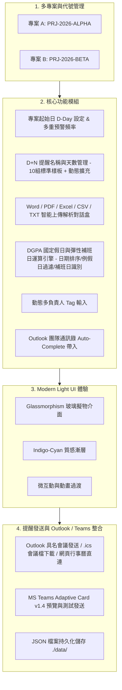
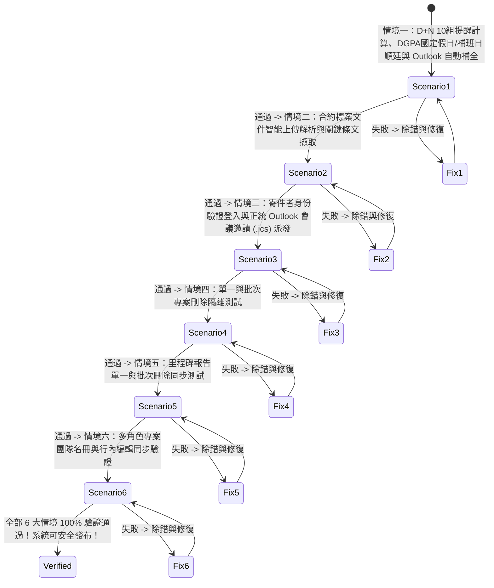

# 📊 專案履約報告繳交提醒系統 (Report Submission Reminder System) 實作規格與計劃

本實作計劃與規格文件記錄 **專案履約報告繳交提醒與 Outlook 會議發布系統** 之完整技術架構、功能規格、視覺設計、DGPA 國定假日/補班日運算邏輯與全自動驗證方案。系統採用 **Node.js Express (後端)** + **React 18 TypeScript Vite (前端)** 全棧架構，整合 **Bright Modern & Glassmorphism 現代 UI/UX 設計規範**，提供履約里程碑自動推算、DGPA 國定假日與補班日精確避開順延、MS Outlook / Teams 會議預約發布與標案合約關鍵日期解析。

---

## 🛠️ 目前技術架構 (Current Tech Stack & Architecture)

- **後端 (Backend)**：Node.js Express (v4.18+), Cors, Multer (檔案上傳與處理), ASP.NET Core API (C# 模組擴充相容)
- **前端 (Frontend)**：React 18, TypeScript, Vite 5.x, Lucide React (圖示庫), Vanilla CSS (Design Tokens & CSS Variables)
- **資料持久化 (Data Storage)**：JSON 檔案資料庫 (`./data/projects.json`, `./data/holidays.json`, `./data/contacts.json`)
- **檔案儲存 (File Storage)**：`./uploads/` 存放上傳之 `.docx`, `.pdf`, `.xlsx`, `.csv`, `.txt` 標案規範與 SOW 文件
- **部署與運行模式**：Express 後端伺服器託管 API 介面與編譯後前端靜態頁面 (Port `5000`)
- **自動化測試套件**：6 大全流程情境測試腳本 (`test_scenarios.js` / `npm test`)

---

## 🎨 前端視覺與 UI/UX 規範 (Design Tokens & Aesthetics)

1. **Design Tokens 視覺系統**：
   - 全域 CSS 變數系統與 Light Slate 色彩對比系統。
   - **底色與層次**：亮色現代背景 (`#f8fafc` / `#f1f5f9`) 搭配高度透光玻璃卡片 (`backdrop-filter: blur(16px)`).
   - **品牌漸層與光效**：Primary Blue-Indigo 漸層與動態發光邊框 (`shadow-sm`, `shadow-md`, `shadow-glow`).

2. **字型與視覺階層 (Typography)**：
   - 載入 `Inter` / `Plus Jakarta Sans` 現代無襯線字型與 `Fira Code` 等寬字體。
   - 大標題採用漸層色文字 (Graduated Text) 與靈活階層。

3. **微互動與動態效果 (Micro-Interactions)**：
   - **按鈕與卡片 Hover**：3D 浮起與彈性過渡 (`transition: all 0.2s ease-in-out`)。
   - **卡片與 Modal 入場**：平滑淡入動畫 (`fadeInUp`)。

4. **核心元件組件庫**：
   - **ProjectSwitcher**：頂部專案切換選單與專案代號 Badge（如 `PRJ-2026-ALPHA`）。
   - **DDayControl**：開工日 (D-Day) 選擇器、雙向提醒天數卡片與多重預警頻率選擇器（提前 1, 3, 5, 7, 14, 30 天發送）。
   - **RuleManager**：10 組預設標準樣板（D+7 啟動會議至 D+240 結案驗收）+ 動態標籤多負責人輸入框（支援 Outlook 團隊通訊錄 Auto-Complete 自動補全）。
   - **HolidayManagementModal**：DGPA 國定假日與彈性補班日雙頁籤管理介面（包含 `🌴 國定假日`、`💼 補班日` 與 `📅 全部明細`），支援依日期升冪排序、無效例假日自動過濾、補班日獨立標示與同步功能。
   - **DocumentUploader**：支援拖曳上傳與智能關鍵日期/條文解析對話盒。
   - **ScheduleTimeline**：色彩標籤化提醒時程時間軸（支援雙向狀態切換：標記為已繳交 / 改為未繳交，以及 MS Outlook / Teams 邀請發送）。
   - **OutlookMeetingModal**：具名寄件者登入驗證、Outlook 網頁版日曆直連發布連結生成與正統 `.ics` (iCalendar v2.0 `RSVP=TRUE`, `BUSYSTATUS:BUSY`) 匯入檔下載。

---

## 🏛️ 系統架構圖 (System Architecture)

---

## 🧪 6 大自動化全流程使用情境驗證方案 (Verification Suite)

系統包含完整的自動化測試指令 `npm test` (`node test_scenarios.js`)，通過率達 **100%**：

### 情境詳細說明：

1. **[Scenario 1] 標準專案創建、D+N 里程碑計算與 DGPA 國定假日/補班日順延**
   - **驗證項目**：建立 `PRJ-2026-ALPHA`，設定 D-Day 為 `2026-09-01`。推算報告死線，遇國定假日自動順延，遇補班日（如 `2026-02-07`）自動識別為有效工作日。

2. **[Scenario 2] 標案合約文件智能上傳解析與互動預覽對話盒**
   - **驗證項目**：上傳 `.docx`, `.pdf`, `.xlsx`, `.csv`, `.txt` 檔案至 `./uploads/`，解析提取關鍵死線日期與自信度指標。

3. **[Scenario 3] 寄件者身份驗證登入與正統 Outlook 會議邀請 (.ics) 派發**
   - **驗證項目**：驗證寄件者 Token、產出符合 iCalendar v2.0 規範 (`RSVP=TRUE`, `BUSYSTATUS:BUSY`) 之 `.ics` 檔與 Outlook Web Calendar Compose 連結。

4. **[Scenario 4] 單一與批次專案刪除隔離測試**
   - **驗證項目**：建立測試專案、測試單一刪除與批次刪除 API，確認資料庫刪除隔離正確性。

5. **[Scenario 5] 里程碑報告單一與批次刪除同步測試**
   - **驗證項目**：測試刪除特定里程碑規則時，時間軸對應之計算項目即時同步刷新。

6. **[Scenario 6] 多角色專案團隊名冊與行內編輯同步驗證**
   - **驗證項目**：更新專案團隊多角色成員（PM, Sales, SA, QA），確認全數欄位正確寫入與前端帶入。

---

## 📋 服務建置與驗證計畫 (Build & Verification Plan)

### 指令建置與測試 (Build & Test Commands)
- **前端編譯打包**：`npm run build:frontend` (使用 TypeScript `tsc` 與 Vite 5.x 輸出至 `frontend/dist/`)
- **執行 6 大情境自動化測試**：`npm test` (執行 `node test_scenarios.js`)
- **啟動 Express 伺服器**：`npm start` (開啟服務於 `http://localhost:5000`)

### 手動 UI 驗證 (Manual UI Verification)
- 開啟 `http://localhost:5000` 進行點擊測試，確認專案切換、D-Day 調整、DGPA 國定假日與補班日 Modal、Outlook 會議邀請發送面板等元件正常維運。
