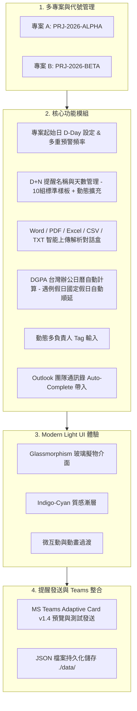
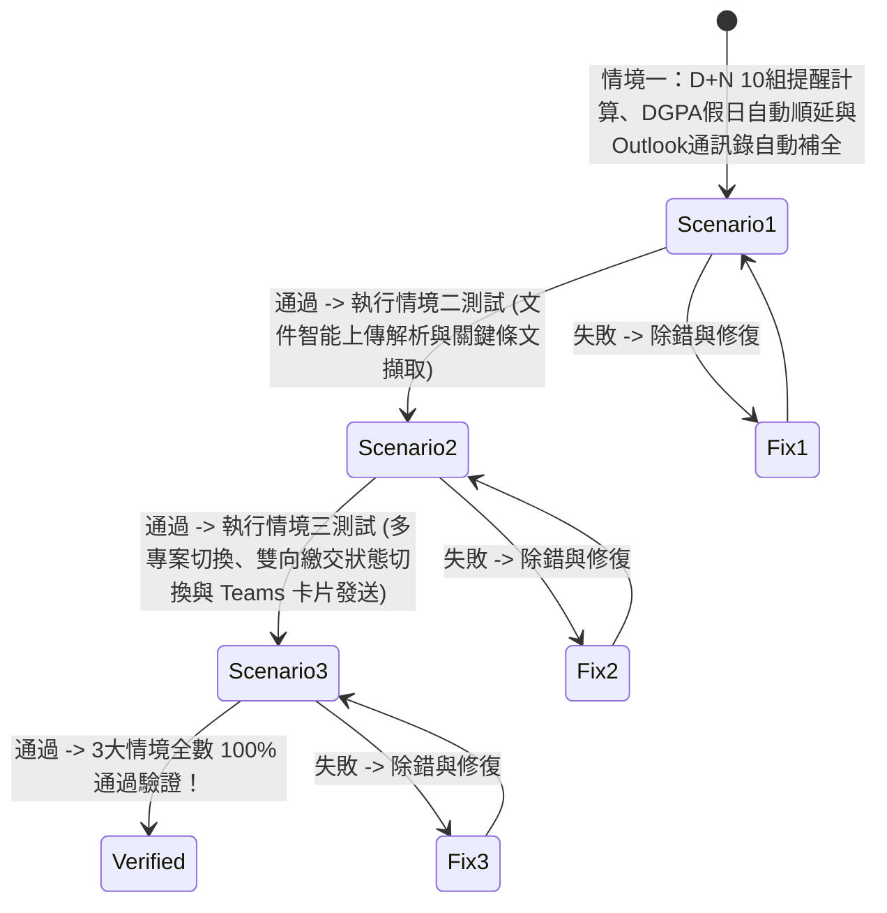

# 📊 專案履約報告繳交提醒系統 (Report Submission Reminder System) 實作規格與計劃

本實作計劃與規格文件記錄**專案履約報告繳交提醒系統**之目前完整技術架構、功能規格、視覺設計與驗證方案。系統採用 **Node.js Express (後端)** + **React 18 TypeScript Vite (前端)** 全棧架構，整合 **Bright Modern & Glassmorphism 現代 UI/UX 設計規範**，提供履約里程碑自動推算、DGPA 國定假日例假日避開順延、MS Teams Adaptive Card 通知發送與標案合約關鍵日期解析。

---

## 🛠️ 目前技術架構 (Current Tech Stack & Architecture)

- **後端 (Backend)**：Node.js Express (v4.18+), Cors, Multer (檔案上傳與處理)
- **前端 (Frontend)**：React 18, TypeScript, Vite 5.x, Lucide React (圖示庫), Vanilla CSS (Design Tokens & CSS Variables)
- **資料持久化 (Data Storage)**：JSON 檔案資料庫 (`./data/projects.json`, `./data/holidays.json`, `./data/contacts.json`)
- **檔案儲存 (File Storage)**：`./uploads/` 存放上傳之 `.docx`, `.pdf`, `.xlsx`, `.csv`, `.txt` 標案規範與 SOW 文件
- **部署與運行模式**：Express 後端伺服器託管 API 介面與編譯後前端靜態頁面 (Port `5000`)

---

## 🎨 前端視覺與 UI/UX 規範 (Design Tokens & Aesthetics)

1. **Design Tokens 視覺系統**：
   - 全域 CSS 變數系統與 Light Slate 色彩對比系統。
   - **底色與層次**：亮色現代背景 (`#f8fafc` / `#f1f5f9`) 配搭配高度透光玻璃卡片 (`backdrop-filter: blur(16px)`).
   - **品牌漸層與光效**：Primary Blue-Indigo 漸層與動態發光邊框 (`shadow-sm`, `shadow-md`, `shadow-glow`).

2. **字型與視覺階層 (Typography)**：
   - 載入 `Inter` / `Plus Jakarta Sans` 現代無襯線字型與 `Fira Code` 等寬字體。
   - 大標題採用漸層色文字 (Graduated Text) 與靈活階層。

3. **微互動與動態效果 (Micro-Interactions)**：
   - **按鈕與卡片 Hover**：3D 浮起與彈性過渡 (`transition: all 0.2s ease-in-out`)。
   - **卡片與 Modal 入場**：平滑淡入動畫 (`fadeInUp`)。

4. **核心元件組件庫**：
   - **ProjectSwitcher**：頂部專案切換選單與專案代號 Badge（如 `PRJ-2026-ALPHA`）。
   - **DDayControl**：開工日 (D-Day) 選擇器、雙向提醒天數卡片與多重預警頻率選擇器（提前 1, 3, 5, 7, 14, 30 天發送）。
   - **RuleManager**：10 組預設標準樣板（D+7 啟動會議至 D+240 結案驗收）+ 動態標籤多負責人輸入框（支援 Outlook 團隊通訊錄 Auto-Complete 自動補全）。
   - **DocumentUploader**：支援拖曳上傳與智能關鍵日期/條文解析對話盒。
   - **ScheduleTimeline**：色彩標籤化提醒時程時間軸（支援雙向狀態切換：標記為已繳交 / 改為未繳交，以及 MS Teams Adaptive Card 一鍵測試發送）。

---

## 🏛️ 系統架構圖 (System Architecture)

---

## 🧪 3 大使用情境驗證方案 (Verification Scenarios)

### 情境一：標準專案創建、D+N 提醒、DGPA 假日自動順延與 Outlook Auto-Complete
- **驗證項目**：
  1. 建立專案 `PRJ-2026-ALPHA`，設定 D-Day 為 `2026-09-01`。
  2. 自動推算 10 組標準履約里程碑報告死線。
  3. 驗證死線落於週六/週日或國定假日（如中秋節 `2026-09-25`）時，系統自動標記「因行政院國定假日/例假日避開日順延」並向後推算至下一工作日。
  4. 負責人欄位輸入文字時跳出 Outlook 通訊錄 Auto-Complete 選單，並成功生成 Tag 標籤。

### 情境二：合約與標案文件智能上傳與條文關鍵日期解析
- **驗證項目**：
  1. 拖曳或選擇 `.docx`, `.pdf`, `.xlsx`, `.csv`, `.txt` 檔案上傳。
  2. 伺服器成功保存檔案至 `./uploads/` 目錄。
  3. 解析對話盒正確擷取關鍵死線日期與條文說明，可勾選併入專案履約時間軸。

### 情境三：多專案切換、雙向繳交狀態切換與 MS Teams 通知
- **驗證項目**：
  1. 多專案資料切換，儀表板即時更新與資料隔離。
  2. 點擊「標記為已繳交」按鈕，進度條與狀態即時更新；再次點擊可恢復「改為未繳交」。
  3. 點擊「Teams 測試發送」，成功生成 Adaptive Card v1.4 格式 JSON，並於 UI 上呈現成功模擬訊息。

---

## 📋 服務建置與驗證計畫 (Build & Verification Plan)

### 自動與指令建置 (Automated Build Commands)
- **前端編譯打包**：`node node_modules/typescript/bin/tsc` 與 `node node_modules/vite/bin/vite.js build` (輸出至 `frontend/dist/`)
- **後端啟動**：`node server.js` (開放在 `http://localhost:5000`)

### 手動驗證 (Manual & UI Verification)
- 透過瀏覽器開啟 `http://localhost:5000` 進行 UI 完整流程測試，確認面板、時間軸、檔案上傳區與 Teams 通知區皆能正常運作。
