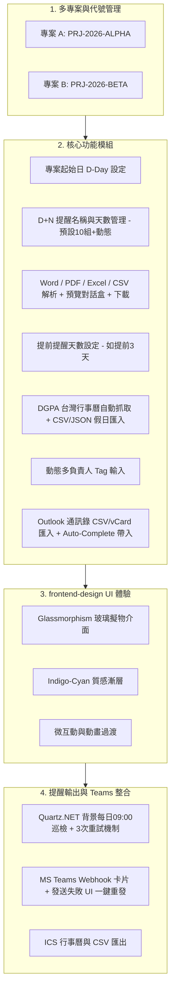
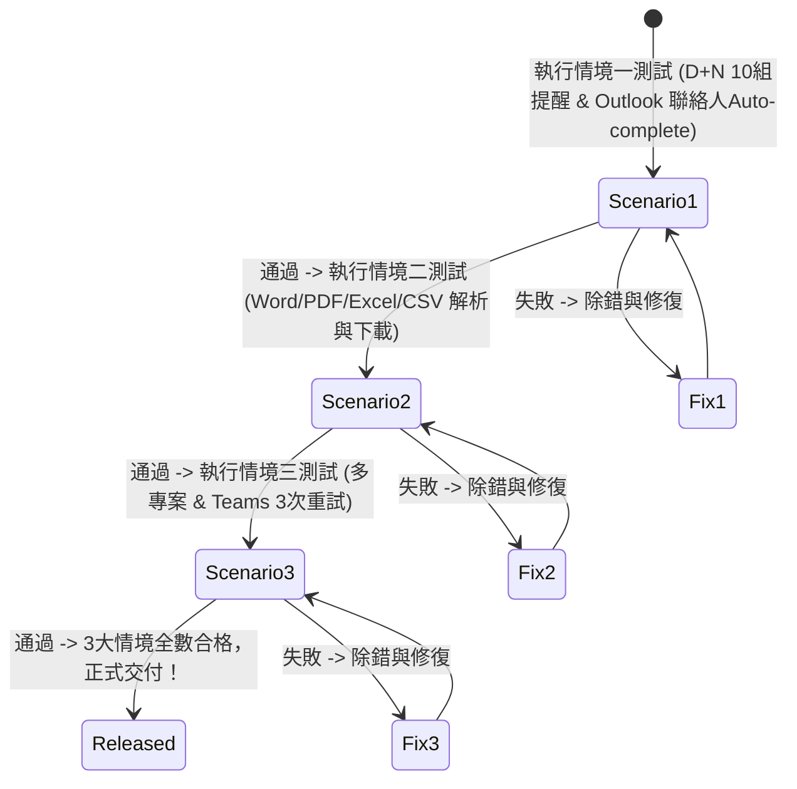

# 報告繳交提醒系統 (Report Submission Reminder System) 實作計劃 - ASP.NET Core + React (frontend-design Skill 版)

本計劃為**報告繳交提醒系統**的完整開發與驗證方案。系統採用 **ASP.NET Core Web API (後端)** + **React TypeScript (前端)** 全棧架構，並完全整合 **`frontend-design` Skill 現代 UI/UX 設計規範**，打造頂級玻璃擬物 (Glassmorphism) 與視覺微互動體驗。

---

## 🎨 Frontend Design Skill 前端視覺與 UI/UX 規範

本系統前端將嚴格遵循 `frontend-design` Skill 規範，建立專業、精緻且極具高質感的現代化介面：

1. **Design Tokens 視覺系統**：
   - 使用 CSS Custom Properties 建立全域主題 Token。
   - **底色與層次**：深色質感底色 (`#0b0f19` / `#111827`) 與玻璃透光卡片 (`surface-glass: rgba(17, 24, 39, 0.7)` + `backdrop-filter: blur(16px)`).
   - **品牌漸層與光效**：Indigo-Cyan 雙色漸層 (`linear-gradient(135deg, #6366f1 0%, #3b82f6 50%, #06b6d4 100%)`) 與發光邊框 (`shadow-glow`).

2. **字型與視覺階層 (Typography)**：
   - 載入 Google Fonts `Plus Jakarta Sans` / `Inter` 現代無襯線字體與 `Fira Code` 等寬字型。
   - 採用 `clamp()` 流體字體大小與 Graduated Text 漸層文字標題。

3. **微互動與動態效果 (Micro-Interactions)**：
   - **按鈕與卡片 Hover**：3D 浮起效果 (`transform: translateY(-3px)`)、微光掠過 (Shimmer) 與 0.25s Ease-Out 彈簧物理過渡。
   - **列表與 Modal 入場**：平滑向上淡入動畫 (`fadeInUp`)。

4. **元件組件庫**：
   - **ProjectSwitcher**：帶有專案代號 Badge 的頂部玻璃切換列。
   - **DDayControl**：直覺式日期選擇器與雙向卡片。
   - **RuleManager**：10 組預設樣板 + 雙欄式名稱/D+N 編輯器 + 動態 Tag 多負責人輸入框（支援 Outlook 搜尋自動補全）。
   - **DocumentUploader**：支援 Word/PDF/Excel/CSV 檔案拖拽上傳區與解析對話盒。
   - **ScheduleTimeline**：色彩標籤化提醒時程清單（含標記已繳交按鈕與 Teams 卡片一鍵預覽）。

---

## 🏛️ 架構決策總結

---

## 3 大使用情境測試驗證方案 (Loop-Until-Pass)

> [!IMPORTANT]
> 開發完成後，將嚴格執行以下 **3 個真實使用情境** 的測試驗證，**必須 100% 全部通過始能宣布正式發布！**

### 情境一：標準專案創建、D+N 提醒、DGPA 假日避開與 Outlook Auto-Complete
- **測試點**：匯入 Outlook 通訊錄檔後，建立 `PRJ-2026-ALPHA`，D-Day (`2026-09-01`)，配置 10 組提醒名稱。輸入 `張` 驗證選單跳出並成功寫入 Tag；驗證遇國定假日自動提前至週五。

### 情境二：上傳 Word / PDF / Excel / CSV 文件、預覽勾選與檔案下載
- **測試點**：上傳包含專案時程的 `.xlsx` 或 `.docx` 檔案，驗證抓取日期與報告名稱後跳出對話盒勾選併入時程，且檔案保存在 `backend/uploads/` 可於前端下載對照。

### 情境三：多專案數據隔離、自動排程巡檢、3次重試與 Teams 一鍵重發
- **測試點**：多專案切換數據隔離驗證；模擬 Webhook 失敗觸發 3 次重試機制與介面「一鍵重發」按鈕；Teams 頻道成功接收含有多負責人標籤的 Adaptive Card。

---

## User Review Required

> [!IMPORTANT]
> **frontend-design Skill 已完整加入實作計劃**！若確認無誤，請點選 **Proceed** 批准計劃，我將立即為您建立專案並開始開發！

---

## Verification Plan

### Automated Verification
- 執行 ASP.NET Core `dotnet test`（包含 JSON 讀寫、DGPA 假日算術、Excel/CSV/Word/PDF 解析、Teams 重試機制測試）。
- 執行 React 前端 `npm run build`。

### Manual Verification
- 依據 3 大情境手動驗證與 Teams 實機連線測試，100% 綠燈通過後始發布。
